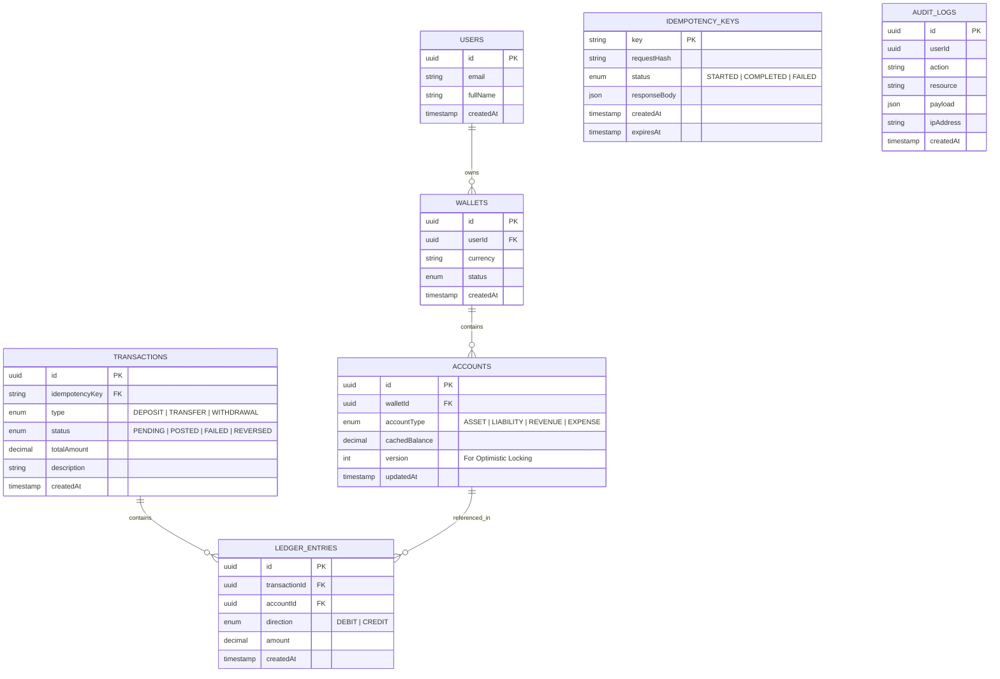
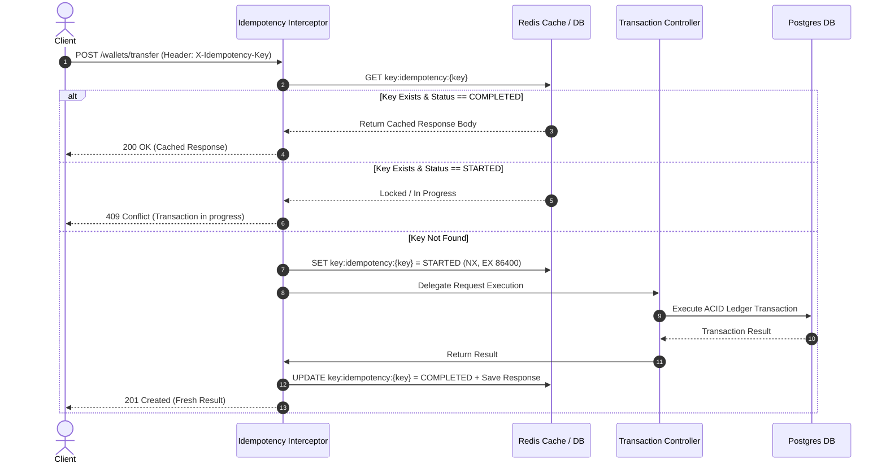

# System Design & Architecture: Digital Wallet & Fintech Transaction API

## 1. System Architecture Diagram

```mermaid
graph TD
    Client[Client / Mobile App] -->|HTTP Request + X-Idempotency-Key| IdempotencyInterceptor[NestJS Idempotency Interceptor]
    
    subgraph NestJS API Layer
        IdempotencyInterceptor -->|Check Key| RedisCache[(Redis Store)]
        IdempotencyInterceptor --> WalletController[Wallet Controller]
        WalletController --> TransactionService[Transaction Core Service]
        TransactionService --> LockManager[Lock Manager / QueryRunner]
    end

    subgraph Database Layer (PostgreSQL - ACID Transaction)
        LockManager -->|1. SELECT FOR UPDATE| AccountsTable[Accounts / Wallets]
        LockManager -->|2. Check Balance| Validation[Validation & Business Rules]
        LockManager -->|3. Insert Tx & Ledger| TransactionTable[Transactions & Ledger Entries]
        LockManager -->|4. Commit Transaction| PostgresDB[(PostgreSQL DB)]
    end

    TransactionService -->|Async Audit Log| AuditService[Audit Logging Service]
    AuditService --> AuditTable[(Audit Trail Log)]
```

---

## 2. Double-Entry Bookkeeping Accounting Model

In financial accounting systems, balance is calculated using the fundamental equation:
$$\text{Assets} = \text{Liabilities} + \text{Equity}$$

Every financial transaction MUST be balanced:
$$\sum \text{Debit Amounts} = \sum \text{Credit Amounts}$$

### Account Classification Table
| Account Type | Normal Balance | Increase Direction | Decrease Direction | Example in Wallet System |
| :--- | :--- | :--- | :--- | :--- |
| **Asset** | Debit | Debit (+) | Credit (-) | System Bank Account / Reserve Account |
| **Liability** | Credit | Credit (+) | Debit (-) | Customer Wallet Balance (Money system owes user) |
| **Revenue** | Credit | Credit (+) | Debit (-) | System Service/Transfer Fees Collected |
| **Expense** | Debit | Debit (+) | Credit (-) | System Operational Cost / Cashback rewards |

### Transaction Example: Peer-to-Peer (P2P) Transfer of $100
1. **User A (Sender) Account** (`Liability`): Debit **$100** (Balance Decreases)
2. **User B (Receiver) Account** (`Liability`): Credit **$100** (Balance Increases)
- Total Debit = $100, Total Credit = $100 ($\text{Net} = 0$).

---

## 3. Database ERD & Schema Design



---

## 4. Database Locking & Concurrency Control

### Option A: Pessimistic Locking (`SELECT FOR UPDATE`)
Used during sensitive balance update transactions.
```typescript
// NestJS / TypeORM QueryRunner implementation snippet
const account = await queryRunner.manager.findOne(Account, {
  where: { id: accountId },
  lock: { mode: 'pessimistic_write' }, // SELECT ... FOR UPDATE
});
```
- **Pros**: Absolutely guarantees no race conditions under high concurrency.
- **Cons**: High database lock contention if transactions take too long.

### Option B: Optimistic Locking (`version` column)
Used for low-contention scenarios or distributed updates.
```typescript
@Entity()
export class Account {
  @PrimaryGeneratedColumn('uuid')
  id: string;

  @Column('decimal', { precision: 18, scale: 4 })
  cachedBalance: number;

  @VersionColumn()
  version: number; // Increment automatically on UPDATE
}
```
- Executed query: `UPDATE account SET cached_balance = 500, version = version + 1 WHERE id = 'xyz' AND version = 3;`
- Returns error if `affectedRows === 0`.

---

## 5. Idempotency Key Engine Design


